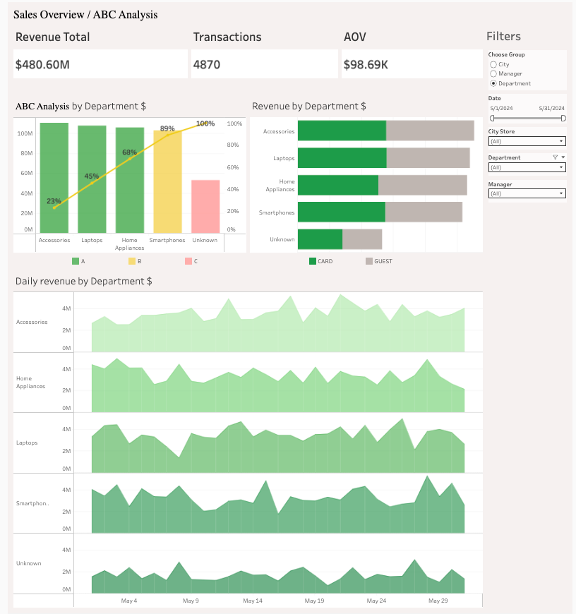

# Sales-analytics-python-tableau

An end-to-end data analytics project featuring a Python ETL pipeline for data preprocessing and an interactive Tableau dashboard for multi-angle sales performance analysis.

**[Live Interactive Dashboard on Tableau Public] https://public.tableau.com/app/profile/ann.ign/viz/Parameters_17899346849220/Sales?publish=yes**

---

## Technical Overview & Workflow

### 1. Python Data Pipeline (pandas)
Raw sales logs were processed and standardized to ensure data integrity before visualization:
* **Currency Standardization:** Extracted and cleaned multi-currency symbols ($, GBP) using regex, converting values into standard numeric formats.
* **Date Parsing:** Normalized inconsistent raw date string formats into a unified YYYY-MM-DD datetime structure.
* **Missing Value Imputation:** Handled missing categorical records by assigning explicit Unknown attributes for unassigned departments and managers.
* **Feature Engineering:** Calculated gross transaction revenues and flagged loyalty card adoption (CARD vs. GUEST).

### 2. Dashboard Capabilities & Diagnostic Value
The Tableau dashboard serves as a dynamic diagnostic tool, allowing users to analyze performance across **Department**, **City Store**, and **Manager** levels via integrated parameters:

* **ABC Concentration Analysis:** Instantly identifies core revenue drivers (~80% of sales, Group A) vs. low-revenue segments (~5% of sales, Group C) to prioritize focus areas.
* **Attribution Audit (Unknown Tracking):** Tracks unattributed transactions (Unknown categories/managers) to isolate gaps in POS data entry and CRM compliance.
* **Loyalty Program Oversight:** Monitors card issuance (CARD vs. GUEST) per sales manager to highlight managers with low loyalty prompt rates during checkout.
* **Manager Benchmarking:** Identifies top-performing managers to establish sales standards, structure onboarding programs, or pair weaker performers for peer training.
* **Trend & Seasonality Monitoring:** Displays daily revenue sparklines per segment to track short-term spikes, dips, or recurring sales patterns.

---

## Tech Stack

* **Python:** `pandas`, `numpy`, `openpyxl`
* **BI Platform:** Tableau Desktop / Tableau Public
* **Methods:** ABC / Pareto Analysis, Dynamic Parameter Controls, Data Cleaning & Feature Engineering

